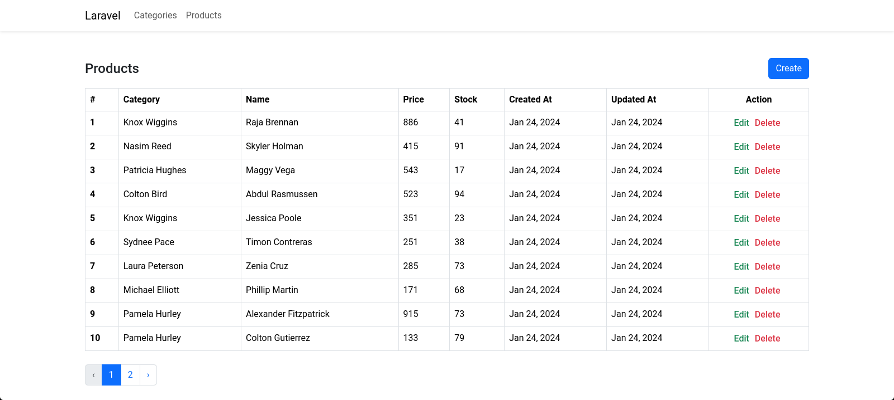
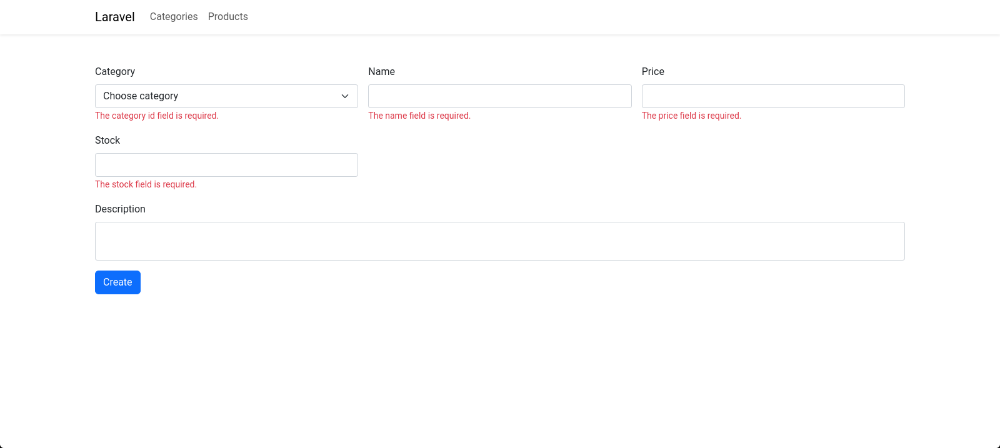

# Laravel 10 One to Many Eloquent Relationship

Hi Viewers, In this example you can see the source code of One to Many Eloquent Relationship in Laravel 10

## Getting Started

### 1. Create a new project

```
composer create-project laravel/laravel one2many
```

### 2. Navigate to project folder

```
cd one2many
```

### 3. Set your Database name, Username, and Password in the .env file

This folder will be available in your project root folder

```
DB_CONNECTION=mysql
DB_HOST=127.0.0.1
DB_PORT=3306
DB_DATABASE= // set database name
DB_USERNAME= // set username
DB_PASSWORD= // set password
```

### 4. Install Yoeunes toast package

```
composer require yoeunes/toastr
```

### 5. Create a Category Migration and Model

```
php artisan make:model Category -m
```

database/migrations/your_categories_table

```
Schema::create('categories', function (Blueprint $table) {
    $table->id();
    $table->string('name');
    $table->timestamps();
});
```

app/Models/Category.php

```
protected $table = 'categories';

protected $fillable = [
    'name',
];

public function products()
{
    return $this->hasMany(Product::class);
}
```

### 5. Create a Product Migration and Model

```
php artisan make:model Product -m
```

database/migrations/your_products_table

```
Schema::create('products', function (Blueprint $table) {
    $table->id();
    $table->foreignId('category_id')->constrained()->onDelete('cascade');
    $table->string('name');
    $table->text('description')->nullable();
    $table->float('price');
    $table->integer('stock');
    $table->timestamps();
});
```

app/Models/Product.php

```
protected $table = 'products';

protected $fillable = [
    'category_id',
    'name',
    'description',
    'price',
    'stock',
];

public function category()
{
    return $this->belongsTo(Category::class);
}
```

### 6. Create Category Controller

```
php artisan make:controller CategoryController --model=Category
```

app/Http/Controllers/CategoryController.php

```
<?php

namespace App\Http\Controllers;

use App\Models\Category;
use Illuminate\Http\Request;

class CategoryController extends Controller
{
    /**
     * Display a listing of the resource.
     */
    public function index()
    {
        $categories = Category::orderBy('id', 'desc')->paginate(10);
        return view('categories.index', compact('categories'))
            ->with('i', (request()->input('page', 1) - 1) * 10);
    }

    /**
     * Show the form for creating a new resource.
     */
    public function create()
    {
        return view('categories.create');
    }

    /**
     * Store a newly created resource in storage.
     */
    public function store(Request $request)
    {
        $request->validate([
            'name' => 'required|string|max:255',
        ]);

        Category::create([
            'name' => $request->name,
        ]);

        toastr()->success('Category created');
        return redirect()->route('categories.index');
    }

    /**
     * Show the form for editing the specified resource.
     */
    public function edit(Category $category)
    {
        return view('categories.edit', compact('category'));
    }

    /**
     * Update the specified resource in storage.
     */
    public function update(Request $request, Category $category)
    {
        $request->validate([
            'name' => 'required|string|max:255',
        ]);

        $category->update([
            'name' => $request->name,
        ]);

        toastr()->success('Category updated');
        return redirect()->route('categories.index');
    }

    /**
     * Remove the specified resource from storage.
     */
    public function destroy(Category $category)
    {
        $category->delete();
        toastr()->success('Category deleted');
        return redirect()->route('categories.index');
    }
}
```

### 7. Create Product Controller

```
php artisan make:controller ProductController --model=Product
```

app/Http/Controllers/ProductController.php

```
<?php

namespace App\Http\Controllers;

use App\Models\Category;
use App\Models\Product;
use Illuminate\Http\Request;

class ProductController extends Controller
{
    /**
     * Display a listing of the resource.
     */
    public function index()
    {
        $products = Product::orderBy('id', 'desc')->paginate(10);
        return view('products.index', compact('products'))
            ->with('i', (request()->input('page', 1) - 1) * 10);
    }

    /**
     * Show the form for creating a new resource.
     */
    public function create()
    {
        $categories = Category::all();
        return view('products.create', compact('categories'));
    }

    /**
     * Store a newly created resource in storage.
     */
    public function store(Request $request)
    {
        $request->validate([
            'category_id' => 'required|exists:categories,id',
            'name' => 'required|string|max:255',
            'description' => 'nullable|string',
            'price' => 'required|numeric',
            'stock' => 'required|integer',
        ]);

        Product::create([
            'category_id' => $request->category_id,
            'name' => $request->name,
            'description' => $request->description,
            'price' => $request->price,
            'stock' => $request->stock,
        ]);

        toastr()->success('Product created');
        return redirect()->route('products.index');
    }

    /**
     * Show the form for editing the specified resource.
     */
    public function edit(Product $product)
    {
        $categories = Category::all();
        return view('products.edit', compact('product', 'categories'));
    }

    /**
     * Update the specified resource in storage.
     */
    public function update(Request $request, Product $product)
    {
        $request->validate([
            'category_id' => 'required|exists:categories,id',
            'name' => 'required|string|max:255',
            'description' => 'nullable|string',
            'price' => 'required|numeric',
            'stock' => 'required|integer',
        ]);

        $product->update([
            'category_id' => $request->category_id,
            'name' => $request->name,
            'description' => $request->description,
            'price' => $request->price,
            'stock' => $request->stock,
        ]);

        toastr()->success('Product updated');
        return redirect()->route('products.index');
    }

    /**
     * Remove the specified resource from storage.
     */
    public function destroy(Product $product)
    {
        $product->delete();
        toastr()->success('Product updated');
        return redirect()->route('products.index');
    }
}
```

### 8. Add categories and products route

routes/web.php

```
<?php

use App\Http\Controllers\CategoryController;
use App\Http\Controllers\ProductController;
use Illuminate\Support\Facades\Route;

/*
|--------------------------------------------------------------------------
| Web Routes
|--------------------------------------------------------------------------
|
| Here is where you can register web routes for your application. These
| routes are loaded by the RouteServiceProvider and all of them will
| be assigned to the "web" middleware group. Make something great!
|
 */

Route::get('/', function () {
    return redirect()->route('categories.index');
});

Route::resource('categories', CategoryController::class)->except('show');
Route::resource('products', ProductController::class)->except('show');
```

### 9. Create Resources

resources/views/layouts/app.blade.php

```
<!DOCTYPE html>
<html lang="en">

<head>
    <meta charset="UTF-8">
    <meta name="viewport" content="width=device-width, initial-scale=1.0">
    <title>@yield('title') | {{env('APP_NAME')}}</title>

    <link rel="stylesheet" href="https://cdn.jsdelivr.net/npm/bootstrap@5.3.2/dist/css/bootstrap.min.css"
        integrity="sha384-T3c6CoIi6uLrA9TneNEoa7RxnatzjcDSCmG1MXxSR1GAsXEV/Dwwykc2MPK8M2HN" crossorigin="anonymous">
</head>

<body>

    <nav class="navbar navbar-expand-lg shadow-sm">
        <div class="container">
            <a class="navbar-brand" href="{{url('/')}}">{{env('APP_NAME')}}</a>
            <button class="navbar-toggler" type="button" data-bs-toggle="collapse"
                data-bs-target="#navbarSupportedContent" aria-controls="navbarSupportedContent" aria-expanded="false"
                aria-label="Toggle navigation">
                <span class="navbar-toggler-icon"></span>
            </button>
            <div class="collapse navbar-collapse" id="navbarSupportedContent">
                <ul class="navbar-nav me-auto mb-2 mb-lg-0">
                    <li class="nav-item">
                        <a class="nav-link" href="{{route('categories.index')}}">
                            Categories
                        </a>
                    </li>
                    <li class="nav-item">
                        <a class="nav-link" href="{{route('products.index')}}">
                            Products
                        </a>
                    </li>
                </ul>
            </div>
        </div>
    </nav>

    @yield('content')

    <script src="https://cdn.jsdelivr.net/npm/bootstrap@5.3.2/dist/js/bootstrap.bundle.min.js"
        integrity="sha384-C6RzsynM9kWDrMNeT87bh95OGNyZPhcTNXj1NW7RuBCsyN/o0jlpcV8Qyq46cDfL"
        crossorigin="anonymous"></script>
</body>

</html>
```

resources/views/categories/index.blade.php

```
@extends('layouts.app')
@section('title', 'Categories')
@section('content')

<div class="container mt-5">
    <div class="row align-items-center g-3 mb-3">
        <div class="col-md-6">
            <h4 class="mb-0">Categories</h4>
        </div>
        <div class="col-md-6 text-md-end">
            <a class="btn btn-primary" href="{{route('categories.create')}}">
                Create
            </a>
        </div>
    </div>

    <div class="table-responsive">
        <table class="table table-hover table-bordered">
            <thead>
                <tr>
                    <th scope="col">#</th>
                    <th scope="col">Name</th>
                    <th scope="col">Created At</th>
                    <th scope="col">Updated At</th>
                    <th class="text-center" scope="col">Action</th>
                </tr>
            </thead>
            <tbody>
                @foreach($categories as $category)
                <tr>
                    <th scope="row">{{++$i}}</th>
                    <td>{{$category->name}}</td>
                    <td>{{$category->created_at->format('M d, Y')}}</td>
                    <td>{{$category->updated_at->format('M d, Y')}}</td>
                    <td class="text-center">
                        <form action="{{route('categories.destroy', $category->id)}}" method="post">
                            @csrf @method('delete')
                            <a class="text-success fw-medium" href="{{route('categories.edit', $category->id)}}">
                                Edit
                            </a>
                            <button class="border-0 bg-transparent text-danger fw-medium" type="submit">Delete</button>
                        </form>
                    </td>
                </tr>
                @endforeach
            </tbody>
        </table>
        @if($categories instanceof \Illuminate\Pagination\LengthAwarePaginator)
        <div class="mt-4">
            {!! $categories->links() !!}
        </div>
        @endif
    </div>
</div>

@endsection
```

resources/views/categories/create.blade.php

```
@extends('layouts.app')
@section('title', 'New Category')
@section('content')

<div class="container mt-5">
    <form class="row g-3" action="{{route('categories.store')}}" method="post">
        @csrf
        <div class="col-md-4">
            <label class="form-label" for="nameInp">Name</label>
            <input class="form-control" id="nameInp" type="text" name="name" value="{{old('name')}}">
            @error('name')<small class="text-danger">{{$message}}</small>@enderror
        </div>
        <div class="col-12">
            <button class="btn btn-primary" type="submit">Create</button>
        </div>
    </form>
</div>

@endsection
```

resources/views/categories/edit.blade.php

```
@extends('layouts.app')
@section('title', 'Edit Category')
@section('content')

<div class="container mt-5">
    <form class="row g-3" action="{{route('categories.update', $category->id)}}" method="post">
        @csrf @method('put')
        <div class="col-md-4">
            <label class="form-label" for="nameInp">Name</label>
            <input class="form-control" id="nameInp" type="text" name="name" value="{{$category->name}}">
            @error('name')<small class="text-danger">{{$message}}</small>@enderror
        </div>
        <div class="col-12">
            <button class="btn btn-primary" type="submit">Update</button>
        </div>
    </form>
</div>

@endsection
```

resources/views/products/index.blade.php

```
@extends('layouts.app')
@section('title', 'Products')
@section('content')

<div class="container mt-5">
    <div class="row align-items-center g-3 mb-3">
        <div class="col-md-6">
            <h4 class="mb-0">Products</h4>
        </div>
        <div class="col-md-6 text-md-end">
            <a class="btn btn-primary" href="{{route('products.create')}}">
                Create
            </a>
        </div>
    </div>

    <div class="table-responsive">
        <table class="table table-hover table-bordered">
            <thead>
                <tr>
                    <th scope="col">#</th>
                    <th scope="col">Category</th>
                    <th scope="col">Name</th>
                    <th scope="col">Price</th>
                    <th scope="col">Stock</th>
                    <th scope="col">Created At</th>
                    <th scope="col">Updated At</th>
                    <th class="text-center" scope="col">Action</th>
                </tr>
            </thead>
            <tbody>
                @foreach($products as $product)
                <tr>
                    <th scope="row">{{++$i}}</th>
                    <td>{{$product->category->name}}</td>
                    <td>{{$product->name}}</td>
                    <td>{{$product->price}}</td>
                    <td>{{$product->stock}}</td>
                    <td>{{$product->created_at->format('M d, Y')}}</td>
                    <td>{{$product->updated_at->format('M d, Y')}}</td>
                    <td class="text-center">
                        <form action="{{route('products.destroy', $product->id)}}" method="post">
                            @csrf @method('delete')
                            <a class="text-success fw-medium" href="{{route('products.edit', $product->id)}}">
                                Edit
                            </a>
                            <button class="border-0 bg-transparent text-danger fw-medium" type="submit">Delete</button>
                        </form>
                    </td>
                </tr>
                @endforeach
            </tbody>
        </table>
        @if($products instanceof \Illuminate\Pagination\LengthAwarePaginator)
        <div class="mt-4">
            {!! $products->links() !!}
        </div>
        @endif
    </div>
</div>

@endsection
```

resources/views/products/create.blade.php

```
@extends('layouts.app')
@section('title', 'New Product')
@section('content')

<div class="container mt-5">
    <form class="row g-3" action="{{route('products.store')}}" method="post">
        @csrf
        <div class="col-md-4">
            <label class="form-label" for="categoryInp">Category</label>
            <select class="form-select" id="categoryInp" name="category_id">
                <option selected hidden value=>Choose category</option>
                @forelse($categories as $category)
                <option value="{{ $category->id }}" {{ old('category_id')==$category->id ?
                    'selected' : '' }}>
                    {{ $category->name }}
                </option>
                @empty
                <option disabled>No Category Found</option>
                @endforelse
            </select>
            @error('category_id')<small class="text-danger">{{$message}}</small>@enderror
        </div>
        <div class="col-md-4">
            <label class="form-label" for="nameInp">Name</label>
            <input class="form-control" id="nameInp" type="text" name="name" value="{{old('name')}}">
            @error('name')<small class="text-danger">{{$message}}</small>@enderror
        </div>
        <div class="col-md-4">
            <label class="form-label" for="priceInp">Price</label>
            <input class="form-control" id="priceInp" type="number" name="price" value="{{old('price')}}">
            @error('price')<small class="text-danger">{{$message}}</small>@enderror
        </div>
        <div class="col-md-4">
            <label class="form-label" for="stockInp">Stock</label>
            <input class="form-control" id="stockInp" type="number" name="stock" value="{{old('stock')}}">
            @error('stock')<small class="text-danger">{{$message}}</small>@enderror
        </div>
        <div class="col-12">
            <label class="form-label" for="descriptionInp">Description</label>
            <textarea class="form-control" id="descriptionInp" name="description">{{old('description')}}</textarea>
            @error('description')<small class="text-danger">{{$message}}</small>@enderror
        </div>
        <div class="col-12">
            <button class="btn btn-primary" type="submit">Create</button>
        </div>
    </form>
</div>

@endsection
```

resources/views/products/edit.blade.php

```
@extends('layouts.app')
@section('title', 'Edit Product')
@section('content')

<div class="container mt-5">
    <form class="row g-3" action="{{route('products.update', $product->id)}}" method="post">
        @csrf @method('put')
        <div class="col-md-4">
            <label class="form-label" for="categoryInp">Category</label>
            <select class="form-select" id="categoryInp" name="category_id">
                <option selected hidden value=>Choose category</option>
                @forelse($categories as $category)
                <option value="{{ $category->id }}" {{ old('category_id', $product->category_id) == $category->id ?
                    'selected' : '' }}>
                    {{ $category->name }}
                </option>
                @empty
                <option disabled>No Category Found</option>
                @endforelse
            </select>
            @error('category_id')<small class="text-danger">{{$message}}</small>@enderror
        </div>
        <div class="col-md-4">
            <label class="form-label" for="nameInp">Name</label>
            <input class="form-control" id="nameInp" type="text" name="name" value="{{$product->name}}">
            @error('name')<small class="text-danger">{{$message}}</small>@enderror
        </div>
        <div class="col-md-4">
            <label class="form-label" for="priceInp">Price</label>
            <input class="form-control" id="priceInp" type="number" name="price" value="{{$product->price}}">
            @error('price')<small class="text-danger">{{$message}}</small>@enderror
        </div>
        <div class="col-md-4">
            <label class="form-label" for="stockInp">Stock</label>
            <input class="form-control" id="stockInp" type="number" name="stock" value="{{$product->stock}}">
            @error('stock')<small class="text-danger">{{$message}}</small>@enderror
        </div>
        <div class="col-12">
            <label class="form-label" for="descriptionInp">Description</label>
            <textarea class="form-control" id="descriptionInp" name="description">{{$product->description}}</textarea>
            @error('description')<small class="text-danger">{{$message}}</small>@enderror
        </div>
        <div class="col-12">
            <button class="btn btn-primary" type="submit">Update</button>
        </div>
    </form>
</div>

@endsection
```

### 10. Adding Custom CSS (Optional)

public/css/main.css

```
@import url("https://fonts.googleapis.com/css2?family=Roboto:ital,wght@0,100;0,300;0,400;0,500;0,700;0,900;1,100;1,300;1,400;1,500;1,700;1,900&display=swap");

/*--------------------------------------------------------------
# General
--------------------------------------------------------------*/
:root {
    scroll-behavior: smooth;
}

body {
    font-family: "Roboto", sans-serif;
}

a {
    cursor: pointer;
    text-decoration: none;
}

a:hover,
a:focus {
    text-decoration: none;
}

input:-webkit-autofill,
input:-webkit-autofill:hover,
input:-webkit-autofill:focus,
input:-webkit-autofill:active {
    transition: background-color 5000s ease-in-out 0s;
}

textarea {
    resize: none;
}

hr {
    margin: 10px 0px;
    color: darkgray;
}

::-moz-selection {
    color: #ffffff;
    background: var(--bs-primary);
}

::selection {
    color: #ffffff;
    background: var(--bs-primary);
}

::-webkit-scrollbar {
    width: 5px;
    height: 8px;
    background-color: #fff;
}

::-webkit-scrollbar-thumb {
    background-color: #aab7cf;
}

/*--------------------------------------------------------------
# Override some default Bootstrap stylings
--------------------------------------------------------------*/
*:focus {
    box-shadow: none !important;
    outline: 0px !important;
}

.form-control,
.form-select {
    border-radius: 4px;
    border: 1px solid #ced4da;
}

.form-control:focus,
.form-select:focus {
    background-color: #fdfdfd;
    border: 1.5px solid var(--bs-primary);
    outline: 0;
    box-shadow: 0 0 0.25rem 0.05rem rgba(105, 108, 255, 0.1);
}
```

resources/views/layouts/app.blade.php

> Add the below line inside your head tag

```
<link rel="stylesheet" href="{{asset('css/main.css')}}">
```

### 11. Run migration

```
php artisan migrate
```

### 12. To fix bootstrap pagination issue

app/Providers/AppServiceProvider.php

```
/**
 * Bootstrap any application services.
 */
public function boot(): void
{
    \Illuminate\Pagination\Paginator::useBootstrap();
}
```

### 13. Run your project

```
php artisan serve
```

## Screenshot


<br>

